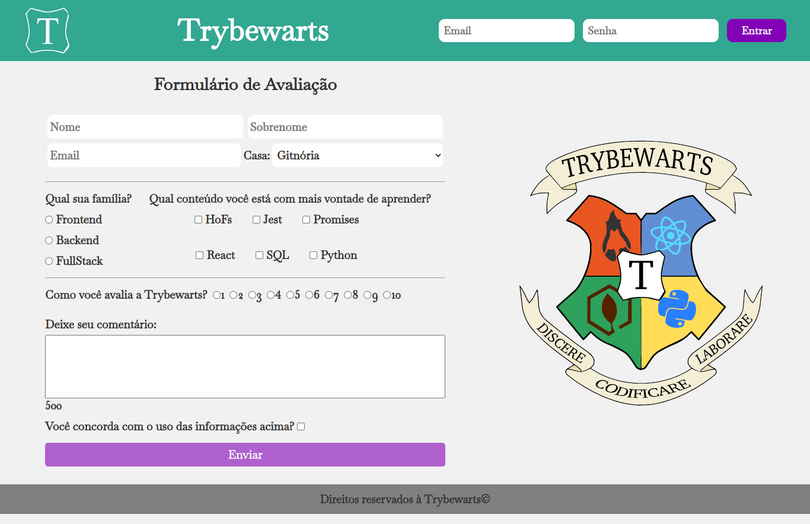

# Projeto Trybewarts 🧙🪄

Projeto realizado no módulo de Fundamentos durante o curso de Desenvolvimento Web pela [Trybe](https://www.betrybe.com/), a escola que te ensina a programar, a aprender e a trabalhar.

## Descrição

Este projeto foi realizado em duplas para desenvolver uma página de formulário da Escola de Magia de Trybewarts, em que as pessoas estudantes poderão enviar seus feedbacks sobre ela. 

O tema desse projeto é baseado na obra 'Harry Potter', de J. K. Rowling.

## 👥 Time

|  |  |
|  :--: | :--: |
| [Tiemi Faustino](https://github.com/tiemifaustino) | [Yan Chapetta](https://github.com/chapetta) |

## 👩‍💻 Tecnologias Utilizadas

- 
- 
- 
- 

## 🛠️ Habilidades Utilizadas

- Criar formulários em HTML;
- Utilizar tags HTML corretas em contextos apropriados;
- Utilizar CSS Flexbox para criar layouts flexíveis;

## 🗄️ Fornecido pela [Trybe](https://www.betrybe.com/)

 - Arquivos no diretório images: `trybewarts-colored.svg`, `trybewarts-header-logo.svg`, `trybewarts-white-filled.svg`, `trybewarts.svg`
 

## 📹 Visualização

